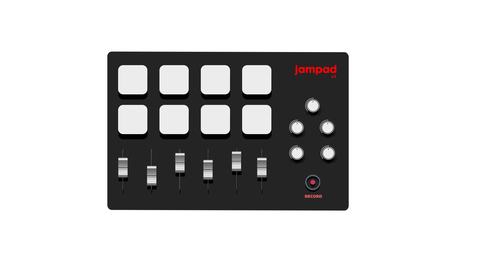

# Projeto 1 - Embarcados

Desenvolvendo um controlador MIDI bluetooth, no estilo drumpad.

## Entrega 1

### Integrantes

- Arthur Boschini da Fonseca
- Pedro Cliquet do Amaral

### Ideia

Controle bluetooth que utiliza a biblioteca "mido" para traduzir os comandos enviados pelo hardware criado para interface MIDI.

### Nome

Jampad

### Usuários

Músicos e produtores musicais que procuram construir suas músicas de maneira rápida e eficiente.

### Software/Jogo 

Ableton/FL Studio

### Jornada do usuário (3 pts)

Chamo-me Kleber, trabalho como DJ e produtor musical de vários outros artistas. Como iniciei na carreira agora, não possuo uma equipe para facilitar algumas tarefas para mim. Portanto, basicamente faço tudo sozinho.

Quando estou com um cliente/artista na hora da produção musical, sempre encontro problemas e dificuldades para criar a percurssão de forma acertiva coma espectativa do mesmo. **A experiência de criação e maturação da bateria de novas músicas acaba sendo massante e nada prazerosa**, muito por conta dessa demora.

Um dos grandes problemas é na gravação dos instrumentos de percurssão, onde a qualidade do áudio pode ser distorcida. Além de que, muitas vezes, na passagem para o software, a sua latência e mixagem são inferiores.
Outro grande problema é a incapacidade de me apresentar ao vivo em algum lugar, pois o arranjo dos instrumentos que necessito para performar cada música é diferente, o que demanda um tempo para ajustar no software via mouse.
 
Espero que haja algum hardware que consiga me auxiliar tanto no processo de criação de novas músicas quanto na performance da mesma!

### Comandos/ Feedbacks (2 pts)

- Regulagem de volume
- Gravação de mensagens MIDI
- Tocar samples
- Controlar efeitos (Reverbe, Chorus, Distortion..)

### In/OUT (3 pts)

- Regulagem de volume: Faders de resistência.       Razão: Como é uma variável contínua, é necessário algo que tenha um grande range de valores que possa assumir. Não utilizaremos potenciômetros pois acreditamos que a experiência do usuário será melhor com o fader, por possibilitar maior agilidade. 
  
- Gravação de mensagens MIDI: Piezo de pressão, push button vermelho.      Razão: Como gravar é uma ação binária, basta um botão para ligar/desligar a função. Uma vez que ligada, ela dependerá dos piezos de pressão para realizar sua gravação. O piezo possui um grande intervalo de valores de resistência, que varia de acordo com a velocidade que o usuário bate, que podem ser modelados para produzir sons diversos.
  
- Tocar samples: Piezo de pressão.      Razão: Por ser outra variável contínua, o usuário deve ter maior capacidade de controlar a sensibilidade e intensidade das notas.
  
- Controlar efeitos (Reverbe, Chorus, Distortion..): Potenciômetros de 10K.      Razão: Como é uma variável contínua, é necessário algo que tenha um grande range de valores que possa assumir. Para isso, utilizaremos potenciômetros, que tornam isso possível.

### Design (2 pts)

